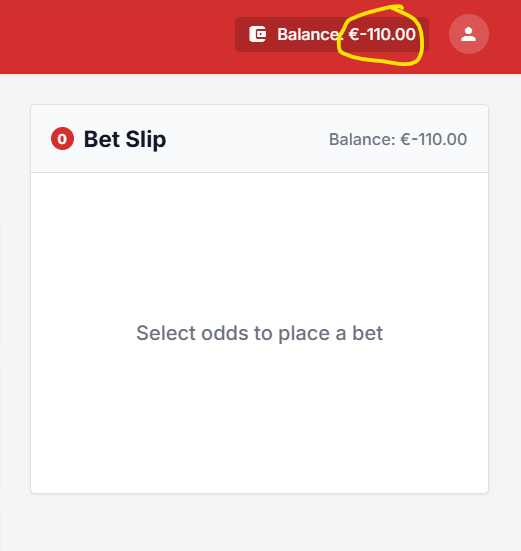

# Issues

## SBP-1 Balance is not updated after placing a bet
**Severity:** Critical 

**Preconditions** 
Balance is reset to initial value

**Reproduction Steps** 
1. Select upcoming match.
2. Click any odds
3. Enter a stake of 100.00 EUR
4. Check that the slip shows selection, stake, balance and payout stake x odds EUR.
5. Click Place Bet.
6. Close the receipt.

**Expected result** 
Bet is successfully placed. Stake is deducted once. Success receipt is displayed with the required bet information.

**Actual result** 
Balance is not deducted, user can again bet the same amount and then balance would be negative

**Business Impact**
Users can place unlimited bets without funds and push their balance negative, causing direct financial loss and possible regulatory breach (credit gambling).

**Evidence** 

## SBP-2 Potential payout calculation is incorrect in Bet Receipt
**Severity:** Critical 

**Preconditions** 
Balance is reset to initial value

**Reproduction Steps** 
1. Select upcoming match.
2. Click any odds
3. Enter a stake of 10.00 EUR
4. Click Place Bet.
5. Check potential payout on the bet receipt: it should be as stake x odds

**Expected result** 
Potential payout is calculated as stake × odds

**Actual result** 
Potential payout is calculated as stake x 2.

**Business Impact**
Customers receive an incorrect record of their potential winnings, leading to settlement disputes, complaints and loss of trust, plus a regulatory risk for misrepresenting bet terms.

**Evidence** 

## SBP-3 Past matches are available for betting
**Severity:** Critical  

**Reproduction Steps** 
1. Open betting app
2. Check match dates

**Expected result** 
Only upcoming/pre-match events should be available for betting

**Actual result** 
Past matches is also available for a betting

**Business Impact**
Users can bet on matches with already-known results, guaranteeing wins and causing direct financial loss, fraud exposure and a breach of betting-integrity regulations.

**Evidence** 
