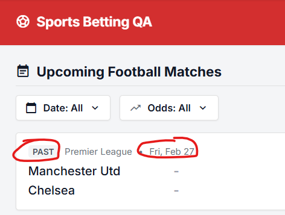
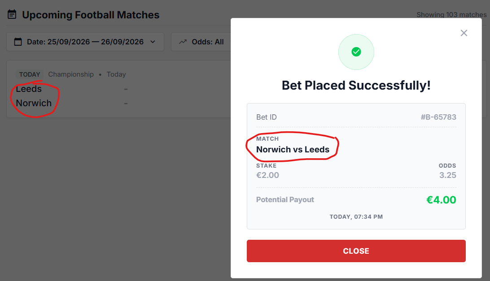

# Issues

## SBP-1 Bet exceeding available balance is accepted by API, resulting in negative balance
**Severity:** Critical 

**Preconditions** 
Balance is reset via `POST /api/reset-balance`. The actual balance is 120.00 EUR (see SBP-6).

**Reproduction Steps** 
1. Call `POST /api/place-bet` with a valid `x-user-id` header and body:
   {"matchId": "championship-leeds-norwich-2026-09-25", "selection": "HOME", "stake": 100}
   The response returns balance 20.
2. Call `POST /api/place-bet` with the same `x-user-id` and body:
   {"matchId": "championship-leeds-norwich-2026-09-25", "selection": "HOME", "stake": 21}
3. Check the response.
4. Open the betting app and check the balance in the header.

**Expected result** 
The second request is rejected with 422 and an insufficient balance error. The balance remains 20.00 EUR (spec section 4.1: stake must not exceed available balance; UI + API).

**Actual result** 
The API returns 200 and places the bet:
{"message": "Bet placed successfully", "matchId": "championship-leeds-norwich-2026-09-25", "selection": "HOME", "stake": 21, "odds": 2.05, "payout": 43.05, "balance": -1, "currency": "USD"}

The balance becomes negative, and the UI header shows "Balance: -1.00 EUR".

**Business Impact:** 
Users can bet more than their available funds via the API and go into a negative balance, which is effectively unsecured credit gambling. This causes direct financial loss and a regulatory breach.

**Evidence** 

## SBP-2 Balance is not updated after placing a bet
**Severity:** Critical 

**Preconditions** 
Balance is reset to initial value

**Reproduction Steps** 
1. Select upcoming match.
2. Click any odds
3. Enter a stake of 100.00 EUR
4. Check that the slip shows selection, stake, balance and payout stake x odds EUR.
5. Click Place Bet.
6. Close the receipt.

**Expected result** 
Bet is successfully placed. Stake is deducted once. Success receipt is displayed with the required bet information.

**Actual result** 
Balance is not deducted, user can again bet the same amount and then balance would be negative

**Business Impact**
Users can place unlimited bets without funds and push their balance negative, causing direct financial loss and possible regulatory breach (credit gambling).

**Evidence** 

## SBP-3 Potential payout calculation is incorrect in Bet Receipt
**Severity:** Critical 

**Preconditions** 
Balance is reset to initial value

**Reproduction Steps** 
1. Select upcoming match.
2. Click any odds
3. Enter a stake of 10.00 EUR
4. Click Place Bet.
5. Check potential payout on the bet receipt: it should be as stake x odds

**Expected result** 
Potential payout is calculated as stake × odds

**Actual result** 
Potential payout is calculated as stake x 2.

**Business Impact**
Customers receive an incorrect record of their potential winnings, leading to settlement disputes, complaints and loss of trust, plus a regulatory risk for misrepresenting bet terms.

**Evidence** 

## SBP-4 Past matches are available for betting
**Severity:** Critical  

**Reproduction Steps** 
1. Open betting app
2. Check match dates

**Expected result** 
Only upcoming/pre-match events should be available for betting

**Actual result** 
Past matches is also available for a betting

**Business Impact**
Users can bet on matches with already-known results, guaranteeing wins and causing direct financial loss, fraud exposure and a breach of betting-integrity regulations.

**Evidence** 

## SBP-5 Spec conflict: minimum stake defined as both 1.00 EUR and 1.01 EUR
**Severity:** Medium 

**Description** 
The minimum stake is defined inconsistently across sections of the spec:
- section 3 Business Rules: Stake min (per bet) = 1.00 EUR
- section 4.4 UI Error Messaging: "Minimum stake is 1.00 EUR"
- section 4.1 Stake Validation (UI + API): Minimum 1.01 EUR

**Steps to observe** 
1. Open Feature Specification – Single Bet Placement.
2. Compare the minimum stake value in sections 3, 4.1 and 4.4.

**Expected result** 
The minimum stake is defined with a single consistent value in all sections of the spec.

**Actual result** 
sections 3 and 4.4 state 1.00 EUR, while section 4.1 states 1.01 EUR.

**Business Impact:** 
Ambiguous requirement may lead to inconsistent stake validation between UI and API, causing occasional rejected minimum bets and customer confusion; no direct financial loss.

## SBP-6 Reset balance response does not match persisted balance
**Severity:** Medium 

**Preconditions** 
Initial configured balance is 125.50 EUR

**Reproduction Steps** 
1. Call `POST /api/reset-balance` with a valid `x-user-id` header.
2. Check the response body.
3. Call `GET /api/balance` with the same `x-user-id`.
4. Open the betting app and check the balance displayed in the header.

**Expected result** 
The balance is reset to 125.50 EUR. The reset response, `GET /api/balance` and the UI all show 125.50 EUR, as the spec requires: "Response body and persisted state must be consistent after reset."

**Actual result** 
The reset response reports the correct value:
{"message": "Balance reset successfully", "balance": 125.5, "currency": "EUR"}

But the persisted balance is 120.00 EUR, both in the API and in the UI:
{"balance": 120, "currency": "EUR"}
UI header shows "Balance: 120.00 EUR" (see attached screenshot).

**Business Impact:** 
Users receive 5.50 EUR less than the configured reset amount while the API confirms a different value, undermining balance integrity and making balance-based test results unreliable. If /reset-balance is only a test or admin utility with no customer exposure, Medium priorty is justified.

**Evidence** 

## SBP-7 Negative stake is accepted by API and increases user balance
**Severity:** Critical 

**Preconditions** 
User balance is 120.00 EUR

**Reproduction Steps** 
1. Call `POST {{base_url}}/place-bet` with a valid `x-user-id` header and body:
   {"matchId": "premier-league-manutd-chelsea", "selection": "HOME", "stake": -1000}
2. Check the response.
3. Call `GET {{base_url}}/balance`.

**Expected result** 
The API rejects the request with **422** and a minimum stake error. No bet is created, and the balance remains 120.00 EUR.

**Actual result** 
The API returns 200 and places the bet:
{"message": "Bet placed successfully", "matchId": "premier-league-manutd-chelsea", "selection": "HOME", "stake": -1000, "odds": 2.45, "payout": -2450, "balance": 1120, "currency": "USD"}

The balance increases by 1000, from 120 to 1120.

**Business Impact:** 
Any user can add unlimited funds to their balance with a single API call and withdraw or bet with money that was never deposited, causing direct and unbounded financial loss.

**Evidence** 

## SBP-8 Place bet response returns wrong currency (USD instead of EUR)
**Severity:** Medium 

**Preconditions** 
User balance is reset via `POST /api/reset-balance`

**Reproduction Steps** 
1. Call `POST {{base_url}}/place-bet` with a valid `x-user-id` header and body:
   {"matchId": "premier-league-manutd-chelsea", "selection": "HOME", "stake": 10}
2. Check the `currency` field in the response.
3. Call `GET {{base_url}}/balance` and compare the `currency` field.

**Expected result** 
The `currency` field is **"EUR"**, as defined in spec §3 (Currency: EUR) and §5.3 (place-bet 200 response: `currency: "EUR"`), and it is consistent with `/balance` and `/reset-balance`.

**Actual result** 
The place-bet response returns `"currency": "USD"`, while `/balance` and `/reset-balance` return `"EUR"`.

**Business Impact:** 
Bet transactions are recorded with the wrong currency, which risks incorrect amounts being displayed to customers, wrong conversions in downstream reporting and accounting, and inconsistent financial records.

## SBP-9 Home and away teams are swapped on the bet receipt
**Severity:** Low 

**Preconditions** 
Match list contains the Championship match Leeds vs Norwich (today)

**Reproduction Steps** 
1. Open the betting app.
2. In the match list, find the match Leeds (home) vs Norwich (away).
3. Click any odds button.
4. Enter a stake of 2.00 EUR and click Place Bet.
5. Compare the team order on the success receipt with the match list.

**Expected result** 
The receipt shows the match in the same home vs away order as the match list and `GET /api/matches`: **Leeds vs Norwich**.

**Actual result** 
The match list shows Leeds (home) vs Norwich (away), but the receipt shows **Norwich vs Leeds**.

**Business Impact:** 
Customers cannot reliably tell which team they bet on, especially since the receipt does not show the selection. This causes confusion, disputes about the placed bet and support contacts.

**Evidence** 
